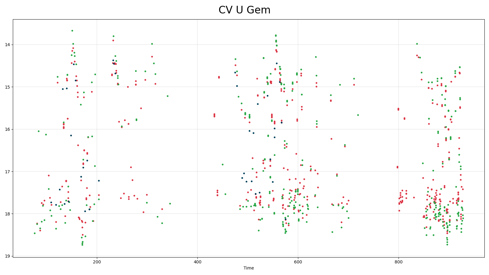
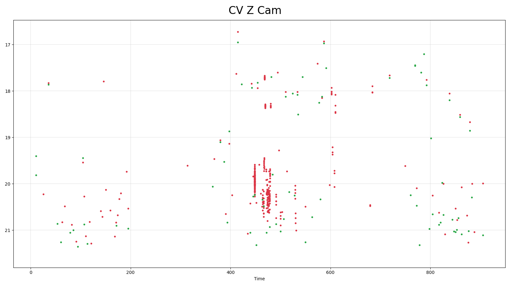
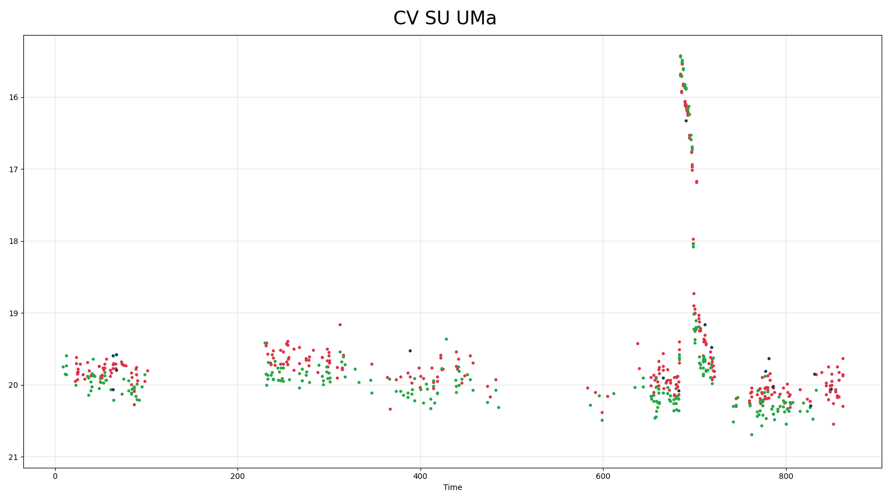
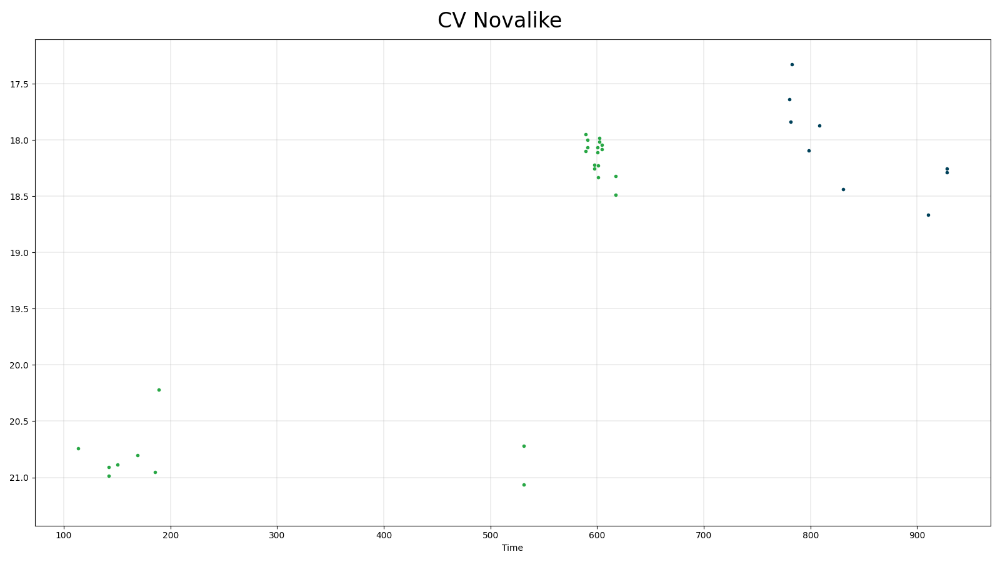

## Cataclysmic Variables (cv)
Cataclysmic variables are close binaries with active mass transfer from a late
type main sequence star or brown dwarf to a white dwarf. There are several different
types of CVs, depending on their causes of variability. These include novae (which
have 9-15 mag outbursts from thermonuclear events on the white dwarf surface), dwarf novae which have 2-9 mag outbursts on weeks to decades timescales due to disk instabilities) and novalikes which do not have outbursts but have high and low states of accretion which cause several magnitudes of brightness change.

### Classification and numbers
- Supertypes
  - variable
  - aperiodic outbursts
  - aperiodic high and low states
  - periodic orbital variability
- Subtypes
  - nova
  - U Gem dwarf nova
  - Z Cam dwarf nova
  - SU UMa/WZ Sge dwarf nova
  - Novalike

- Occurrence rate: common, several thousand expected in ZTF data

### ZTF light curves

#### Description
CVs are easy to recognize by their distinctive light curve shape, colors and
high amplitude variability. The outbursts are non-periodic.
They can sometimes be confused with supernovae, flare stars or long period variables.

#### Light curve characteristics
- non-periodic variable but recur on some timescale
- outburst timescale range: days to decades
- amplitude: 9-15 mag (nova), 2-9 mag (dwarf nova), 1-4 mag (novalike)
- light curve shape:
    - sawtooth; steep rise and slow decay (subtype nova)
    - symmetrical to slightly sawtooth (subtype U Gem)
    - standstills about 1 mag below outburst level for weeks (subtype Z Cam)
    - fast rise and extended plateau for 1-2 weeks followed by steeper decline     (subtype SU UMa/WZ Sge)
    - extended (days-weeks) states at either high or low brightness
- can show periodic modulation of the light curve on orbital timescales of hours

#### Other characteristics and selection methods
- intrinsic CV colors: blue, (g-r < 0.6).
  Reddening is usually not important except for places in the galactic plane.
- absolute magnitude at quiescence: 8<G<14

### References and further reading:
- Warner 1995: Cataclysmic Variable Stars
