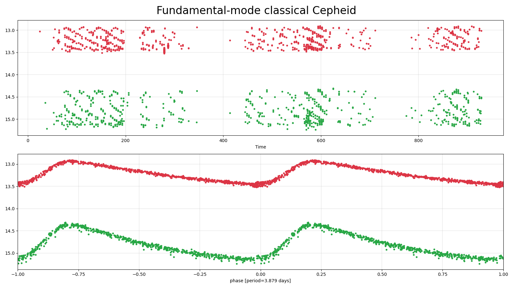
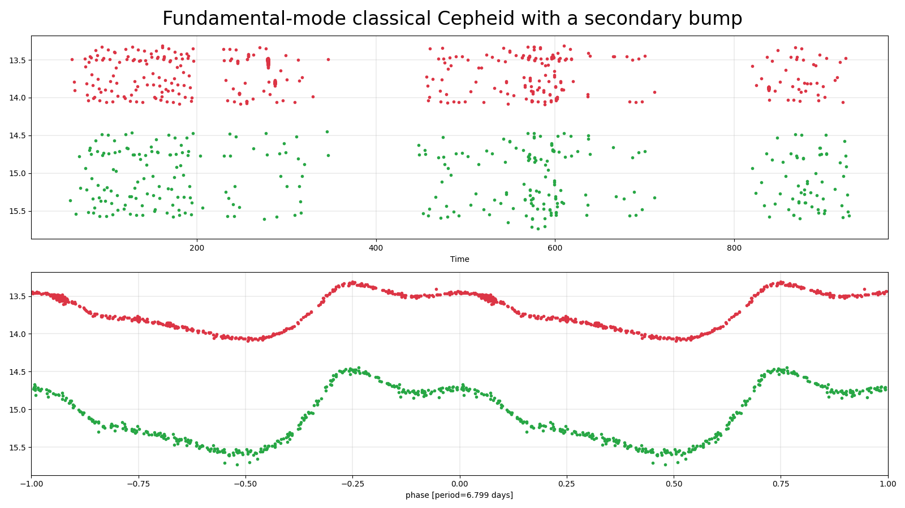
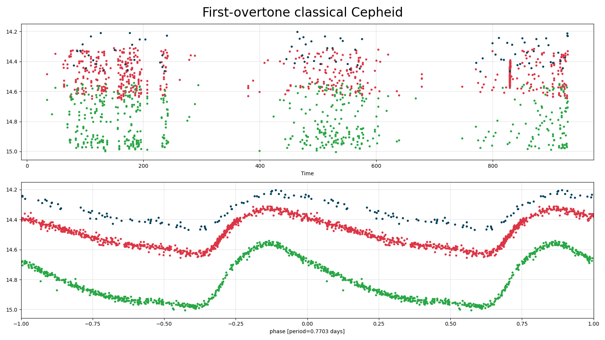
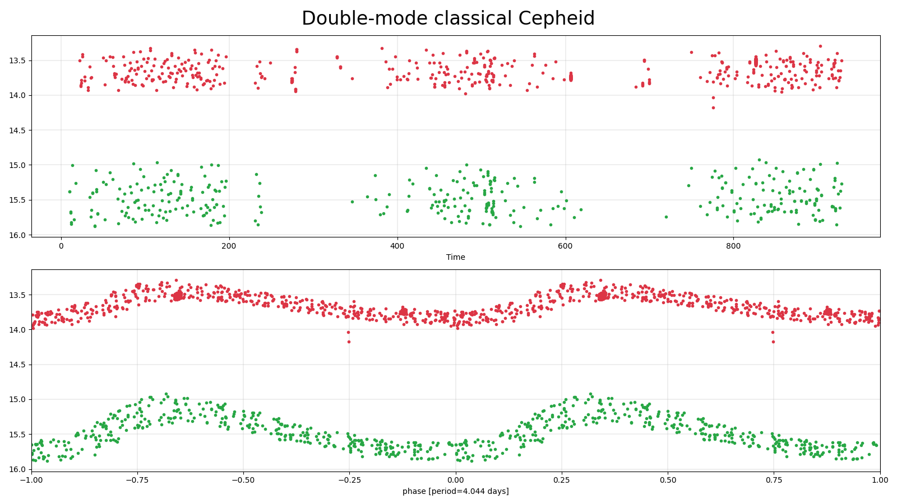
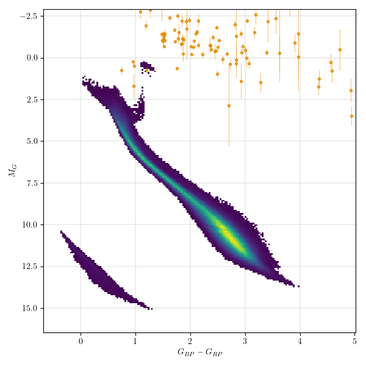

## Classical Cepheids (cep)
Classical Cepheids are young, bright (100-10,000 solar luminosities) supergiant stars that pulsate with periods of 1 to 100 days (typically several days). They are located in the main instability strip in the H-R diagram. Cepheids follow a famous pulsation period-luminosity relation, allowing the absolute magnitude of a Cepheid, and thus its distance, to be inferred from the pulsation period. Thus, Cepheids are used to measure distances to nearby galaxies.

### Classification and numbers
- Supertypes
  - variable
  - periodic
  - pulsator
- Occurrence rate: rare, about 103 expected in ZTF data, mostly in the Galactic plane and in M31

### ZTF light curves

#### Description
Fundamental-mode Cepheids are easy to recognise by their distinctive sawtooth light curve shape (with a rapid rise to maximum light and a slower decline) and period range (from 1 to 100 days). A secondary bump may be seen in the light curves of some Cepheids with periods in the range 6-20 days. Cepheids pulsating in the first overtone have lower amplitudes and more symmetric light curves than fundamental-mode Cepheids. Their periods (in the Milky Way) range from 0.24 to 8 days. The lower period limit is arbitrary since there is no natural boundary between first-overtone Cepheids and delta Scuti stars. Some Cepheids pulsate both in the fundamental mode and first overtone, the period ratio ranges from 0.68 to 0.77.

#### Light curve characteristics
- periodic variable
- period range: 1-100 days (fundamental-mode pulsators), 0.24-8 days (first-overtone pulsators)
- amplitude: moderate amplitude (~0.3 to 0.8 mag)
- light curve shape:
    - smooth, sawtooth variations (blue/green filters show stronger sawtooth pattern); steep rise and slow decay
    - Classical Cepheids with pulsation periods 6-20 days may have a secondary bump

#### Other characteristics and selection methods
- intrinsic Cepheids colors: Bp-Rp = 0.8 -- 2.0 mag, but as these stars are located near the Galactic plane, the reddening may be significant
- absolute magnitude: -6<G<-2
- located close to the Galactic plane (within ~10 degrees)

### References and further reading:
- Soszynski, I. et al. (2008) <a href="https://ui.adsabs.harvard.edu/abs/2008AcA....58..163S/abstract">The Optical Gravitational Lensing Experiment. The OGLE-III Catalog of Variable Stars. I. Classical Cepheids in the Large Magellanic Cloud</a>
- Udalski, A. et al. (2018) <a href="https://ui.adsabs.harvard.edu/abs/2018AcA....68..315U/abstract">OGLE Collection of Galactic Cepheids</a>
- Rimoldini, L. et al. (2019) <a href="https://ui.adsabs.harvard.edu/abs/2019A%26A...625A..97R/abstract">Gaia Data Release 2. All-sky classification of high-amplitude pulsating stars</a>
- Skowron, D. et al. (2020) <a href="https://ui.adsabs.harvard.edu/abs/2019Sci...365..478S/abstract">A three-dimensional map of the Milky Way using classical Cepheid variable stars</a>
