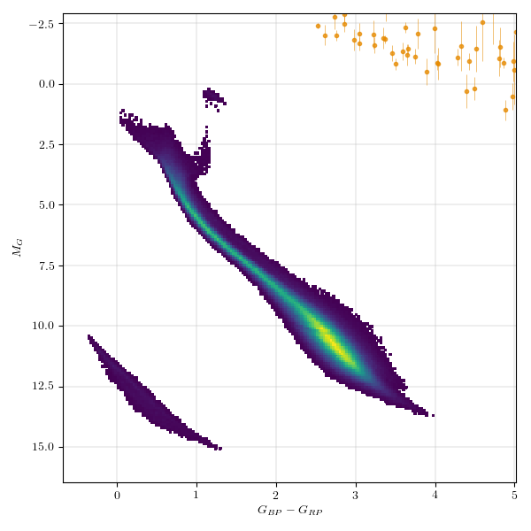

## Long Period Variables (lpv)
Long Period Variables have periods over several tens of days.
They incorporate various groups of cool luminous pulsators.
The canonical example is Mira.

### Classification and numbers
- Supertypes
  - variable
  - periodic
  - pulsator
- Subtypes
  - Miras
  - Semiregulars
  - OSARGs - OGLE Small Amplitude Red Giants (some astronomers do not include these under LPVs)
- Occurrence rate: very common, about 105 expected in ZTF data
- Non LPV wth Long Periods
  - RV Tau - Cepheid IIs
- Other possible confusions
  - YSOs - their variations tend to be over shorter periods

### ZTF light curves

#### Description
Long period variables have periods from several tens of days to over thousand day and are
easy to identify due to the slow variations.

#### Light curve characteristics
- periodic variable
- period range: 100-1000 days
- amplitude: over a mag (Mira), or a few tenths of a mag to 1 or 2 mags (semiregulars)
- light curve shape:
    - periodic sinusoidal (Mira)
    - semiregular (Semiregular)

#### Other characteristics and selection methods
- intrinsic lpv colors: red
- absolute magnitude:

### References and further reading:
- Mowlawi et al., 2018, A&A 618, A58, The first Gaia catalogue of long-period variable candidates [arxiv:1805.02035](https://arxiv.org/pdf/1805.02035.pdf)
- Soszynski et al., 2009, AcA, 59, 239S, The Optical Gravitational Lensing Experiment. The OGLE-III Catalog of Variable Stars. IV. Long-Period Variables in the Large Magellanic Cloud [arxix:0910.1354](https://arxiv.org/pdf/0910.1354.pdf)
- Soszynski et al., 2008, AcA, 58, 293S, The Optical Gravitational Lensing Experiment. The OGLE-III Catalog of Variable Stars. II.Type II Cepheids and Anomalous Cepheids in the Large Magellanic Cloud [arxiv:0811.3636](https://arxiv.org/pdf/0811.3636.pdf)
