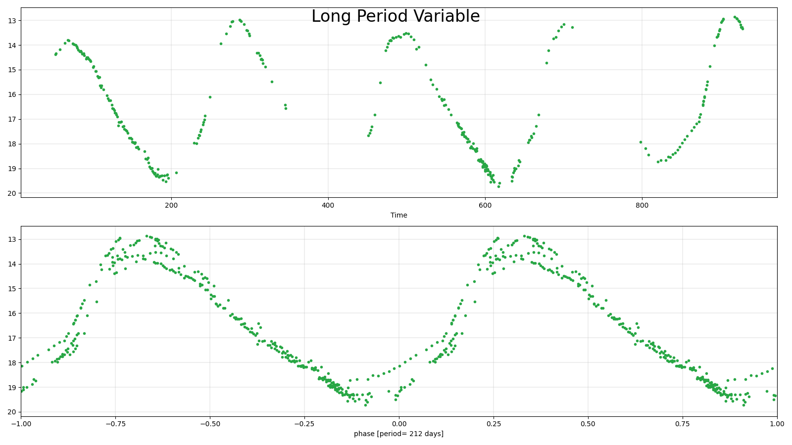

## Long Period Variables (lpv)
Long Period Variables have periods over several tens of days.
They incorporate various groups of cool luminous pulsators.
The canonical example is Mira.

### Classification and numbers
- Supertypes
  - variable
  - periodic
  - pulsator
- Subtypes
  - Miras
  - Semiregulars
  - L stars
  - RV Tau
- Occurrence rate: very common, about 105 expected in ZTF data

### ZTF light curves

#### Description
Long period variables have periods from several tens of days to hundreds of days and are
easy to identify due to the slow varioations.

#### Light curve characteristics
- periodic variable
- period range: 100-1000 days
- amplitude: up to X mag (Mira), or Y mag (semiregulars)
- light curve shape:
    - periodic sinusoidal (Mira)
    - semiregular (Semiregular)
    - irregular

#### Other characteristics and selection methods
- intrinsic lpv colors: red
- absolute magnitude:

### References and further reading:
- Mowlawi et al., 2018, A&A 618, A58, The first Gaia catalogue of long-period variable candidates
