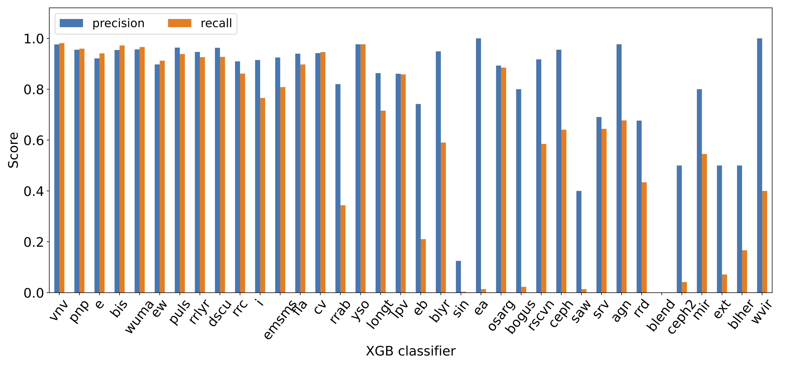

# Guide for Fritz Scanners
This page is a guide the SCoPe classification process. It contains sections on the classification taxonomies we use, definitions of each classification that may be posted to Fritz, An explanation of the binary classifier algorithms we train and the workflow we run on transient candidates, and plots of each classifer's current precision and recall scores.

## Two classification taxonomies
The goal of SCoPe is to use machine learning algorithms to reliably classify each ZTF source with as much detail as possible. The level of classification detail will vary across the broad range of ZTF sources. Factors that can affect the level of source classification include the quantity and quality of the data, the similarity of the training set to the source in question, and the existence of new kinds of variable sources in the data. With this in mind, we adopt two kinds of taxonomies which contain the labels we use to classify ZTF sources.

### Ontological classifications
The first taxonomy is ontological and contains specific kinds of astrophysical sources. On Fritz, this is called `Sitewide Taxonomy`. See the table below for the current ontological classifications, training set abbreviations and definitions, ordered by low to high detail:

| classification | abbreviation | definition |
| -------------- | ------------ | ---------- |
| pulsator | `puls` | Pulsating star |
| AGN | `agn` | Active Galactic Nucleus |
| YSO | `yso` | Young Stellar Object |
| CV | `cv` | Cataclysmic Variable |
| binary | `bis` | binary system |
| Cepheid | `ceph` | Cepheid variable star |
| Delta Scu | `dscu` | Delta Scu star |
| Pop II Cepheid | `ceph2` | Population II Cepheid variable star |
| RR Lyr | `rrlyr` | RR Lyr star |
| LPV | `lpv` | Long Period Variable star |
| MS-MS | `emsms` | Eclipsing MS-MS binary |
| W UMa | `wuma` | W UMa binary system |
| Beta Lyr | `blyr` | Beta Lyr binary |
| RS CVn | `rscvn` | RS CVn binary |
| RRab | `rrab` | RR Lyr ab star |
| RRc | `rrc` | RR Lyr c star |
| RRd | `rrd` | RR Lyr d star |
| Mira | `mir` | Mira variable star |
| SRV | `srv` | Semi-regular variable star |
| OSARG | `osarg` | OGLE small-amplitude red giant star |

*Refer to the field guide for more information about these classes.*

### Phenomenological classifications
In consideration of the importance of having some information about a source (even if not a definitive ontological classification), we also employ a phenomenological taxonomy with labels that describe light curve-based features. This taxonomy is called `SCoPe Phenomenological Taxonomy` on Fritz. See the table below for the current phenomenological classifications, training set abbreviations and definitions:

| classification | abbreviation | definition |
| -------------- | ------------ | ---------- |
| variable | `vnv` | Light curve shows variability |
| periodic | `pnp` | periodic variability |
| irregular | `i` | irregular variability |
| eclipsing | `e` | eclipsing phenomenology |
| sinusoidal | `sin` | sinusoidal phenomenology |
| sawtooth | `saw` | sawtooth phenomenology |
| long timescale | `longt` | long timescale variability |
| flaring | `fla` | flaring phenomenology |
| EA | `ea` | EA eclipsing phenomenology |
| EB | `eb` | EB eclipsing phenomenology |
| EW | `ew` | EW eclipsing phenomenology |
| blend | `blend` | blended sources phenomenology |

*Refer to the field guide for more information about these classes.*

## Independent binary classifiers
We train a binary classifier for every label in these taxonomies. This choice allows more than one classification to be assigned to a source, often with varying levels of detail. This is important not only due to the practical challenges outlined above, but also because some sources merit more than one classification (e.g. an eclipsing binary system containing a flaring star). The independence of binary classifiers allows for future updates to the taxonomies without a revision of the current results from each existing classifier.

We classify each ZTF light curve separately in recognition of systematics that may exist between ZTF fields and bands. Before posting results to Fritz, we aggregate these classification results on a source-by-source basis. The details of this workflow are described in the next section.

## Classification process

### Machine learning algorithms/training
We currently employ a convolutional/dense neural network (DNN) and gradient-boosted decision trees (XGBoost, XGB) to perform classification. The process is initially a regression problem, with classifiers assigning a classification probability that ranges between 0 and 1 for each source. We then apply a probability threshold to determine whether to include each source as a positive or negative example when minimizing the binary cross-entropy loss function.

We trained each binary classifier algorithm using a training set containing ~80,000 sources labeled manually (~170,000 light curves). The training set is available on Fritz in group 1458 (Golden Dataset Unique Sources).

### Repeated workflow for transients
The following SCoPe workflow currently runs every two hours as a cron job:

- Query Fritz for GCN events within the last 7 days
- For each event, query all candidates within the 95% confidence localization
- For each candidate, query existing ZTF DR16 light curves within 0.5 arcsec
- For ZTF light curves with 50 or more epochs of data, generate SCoPe features and run through all trained binary classifiers (DNN and XGB)
- Consolidate light curve classifications by matching Gaia, AllWISE or Pan-STARRS1 IDs, computing the mean probabilities among all light curves for a source.
  - Each source will now have a set of classifications from both the DNN and XGB algorithms.
- For each ZTF source, compute mean classification probabilities between DNN and XGB results.
- For classifications having a mean probability ≥ 0.7, post to the candidate page.
  - SCoPe classifications will be color-coded with blue text (instead of the default black) and will be preceded by the `ML: ` prefix.
  - ***Note that these classifications do not pertain to the candidate itself, but persistent ZTF sources within 0.5 arcsec.***
  - The time series and phase-folded ZTF light curves used for classification are posted as comments on their associated candidate.

## Classifier performance
The bar plots below show the precision and recall metrics for the DNN and XGB classifiers. 'Missing' bars indicate classifiers which did not have enough examples to train successfully.

