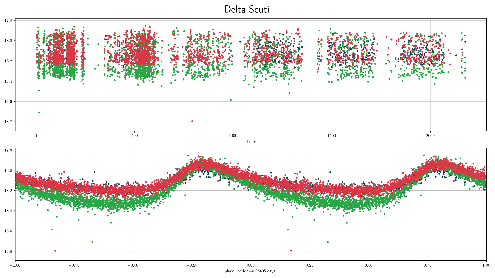
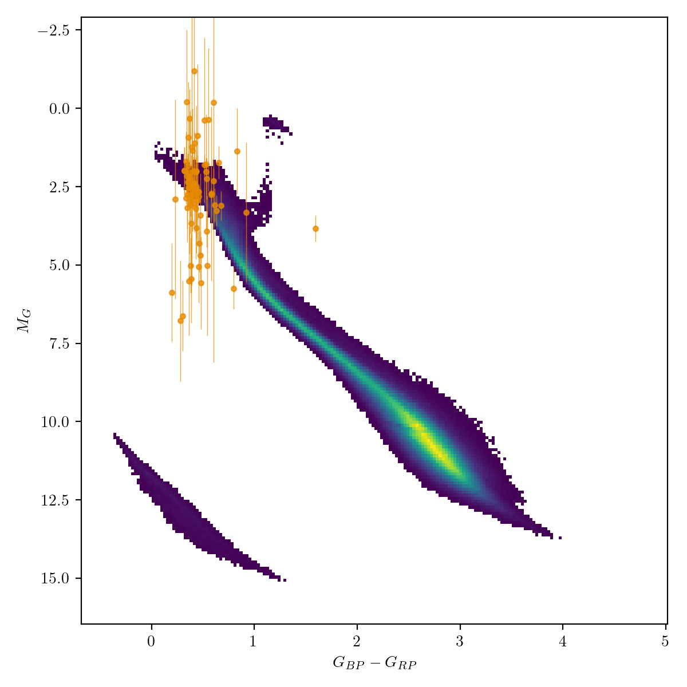
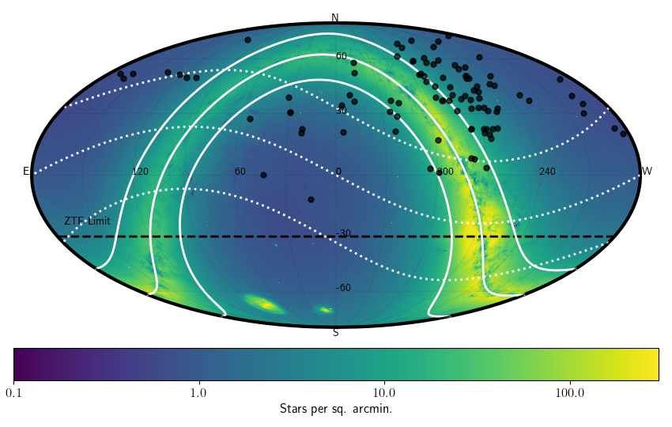

## Delta Scuti (dscu)
Delta Scuti variables are classic pulsating stars (i.e., they are stars passing through the [instability strip](https://en.wikipedia.org/wiki/Instability_strip)). As these stars expand and contract (i.e. pulsate) their size and temperature changes leading to regular, smooth variations in their brightness. Delta Scuti stars are smaller than both Cepheids and RR Lyrae stars, which leads to a short period of oscillations (typically anywhere between 0.03 days and 0.3 days).

### Classification and numbers
- Supertypes
  - variable
  - periodic
  - pulsator
- Occurrence rate: very common, about 104 expected in ZTF data

### ZTF light curves

#### Description
Delta Scuti are easy to recognise by their distinctive light curve shape and period range, which distinguishes them from RR Lyrae and Cepheids.

#### Light curve characteristics
- periodic variable
- period range: 0.03-0.3 days
- amplitude: Small amplitude (between 0.05 and 0.3)
- light curve shape:
    - smooth, sawtooth variations (blue/green filters show stronger sawtooth pattern); steep rise and slow decay

#### Other characteristics and selection methods
- intrinsic Delta Scuti colors: blue, that of A/F type main sequence stars (g-r = -0.1 -- 0.5).
  Reddening can be significant since these stars can be detected at large distances.
- absolute magnitude: 0<G<5

### References and further reading:
- Sterken & Jasschek: Light curves of variable stars
