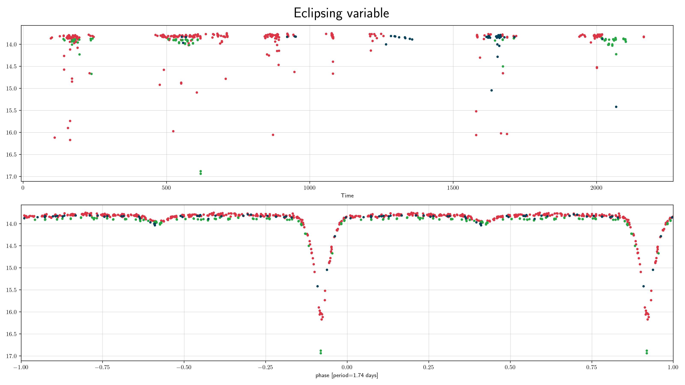
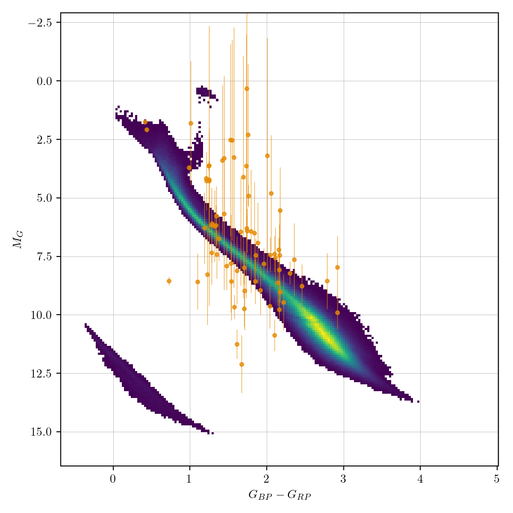
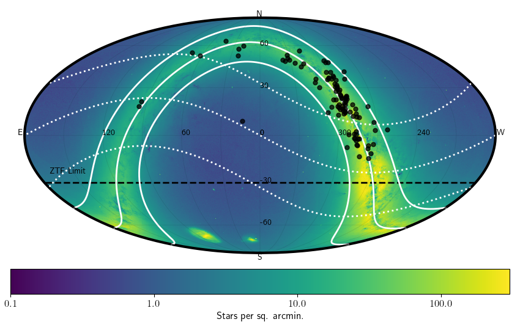

## Eclipsing Variables (e)

Eclipsing variables are binary star systems where the orbital plane is aligned
nearly along the observer's line of sight. The binary components pass in front of
one another from the observer's perspective and so their combined brightness
decreases periodically.

### Classification and numbers
- Supertypes
  - variable
  - periodic
- Subtypes
  - EA (detached)
  - EB (semi-detached)
  - EW (overcontact / W UMa)
- Occurrence rate: very common, about 106 expected in ZTF data

### ZTF light curves

#### Description
Eclipsing binaries show regular, periodic "V-shape" dips in their phase-folded
light curves, which may be sharp or rounded depending on the system. EA-type
systems have well-separated eclipses with flat out-of-eclipse portions. EB-type
systems show continuously varying light curves. EW-type (W UMa) systems have
nearly equal depth eclipses and are sinusoidal-like due to the shared envelope.

#### Light curve characteristics
- periodic variable
- period range: minutes to years
- amplitude: ~0.1 to several magnitudes
- light curve shape:
    - sharp V-shaped dips (EA)
    - continuously varying with unequal minima (EB)
    - nearly sinusoidal with equal-depth minima (EW)

#### Other characteristics and selection methods
- eclipsing binaries span a wide range of spectral types
- period and light curve shape are the primary classification criteria
- color information can help distinguish from pulsators at similar periods

### References and further reading:
- VSX: https://www.aavso.org/vsx/index.php?view=about.vartypes
- Sterken & Jasschek: Light curves of variable stars
