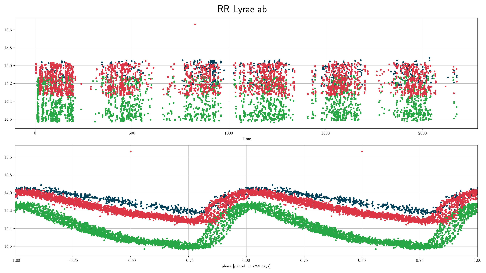
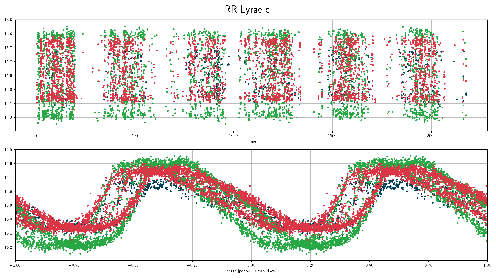
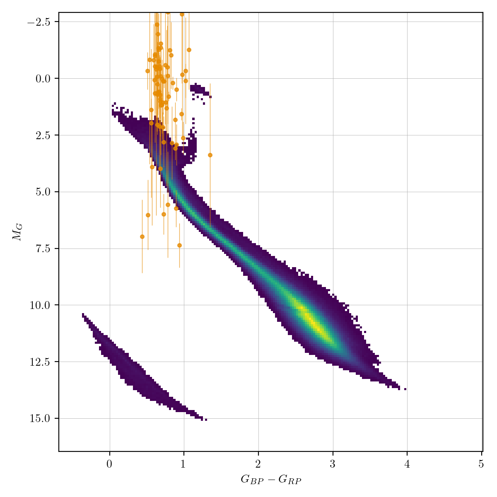
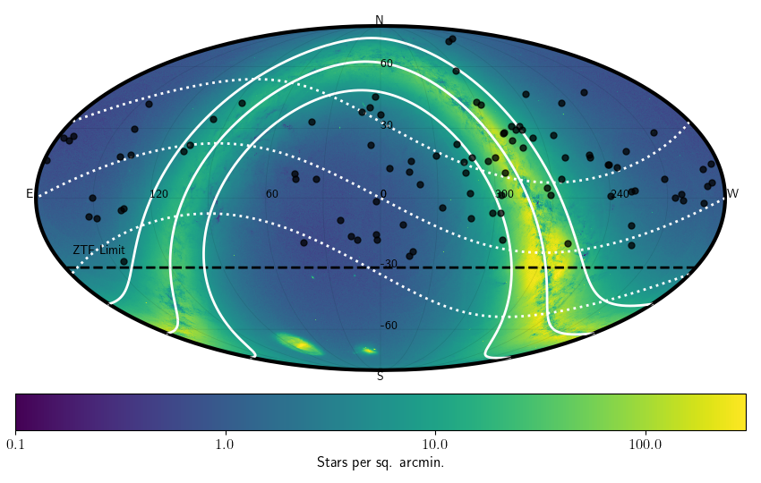

## RR Lyrae (rrlyr)
RR Lyrae are pulsating horizontal branch dA/dF stars with a mass 0.5 of Solar masses.
They are part of the main 'instability strip' in the HR-diagram,
where stars pulsate due to the double ionisation of He.
The two main subtypes are `ab` and `c`,

### Classification and numbers
- Supertypes
  - variable
  - periodic
  - pulsator
- Subtypes
  - RR Lyrae ab
  - RR Lyrae c
- Occurrence rate: very common, about 105 expected in ZTF data

### ZTF light curves

#### Description
RR Lyrae (ab) are easy to recognise by their distinctive light curve shape and
high amplitude variability.
RR Lyrae (c) are a bit more of a challenge since their light curve shape is more sinusoidal.
For low-SNR cases they can sometimes be confused with contact binaries (EW),
which occur at similar periods and have sinusoidal-like light curves.

#### Light curve characteristics
- periodic variable
- period range: 0.2-1 days
- amplitude: up to 1 mag (subtype ab), or 0.5 mag (subtype c)
- light curve shape:
    - sawtooth; steep rise and slow decay (subtype ab)
    - periodic sinusoidal (subtype c)
- can show modulation of the light curve shape on timescales of ~100 days (Blazhko effect)

#### Other characteristics and selection methods
- intrinsic RR Lyrae colors: blue, that of A/F type main sequence stars (g-r = -0.1 -- 0.5).
  Reddening can be significant since these stars can be detected at large distances.
- absolute magnitude: -1<G<1

### References and further reading:
- Sterken & Jasschek: Light curves of variable stars
