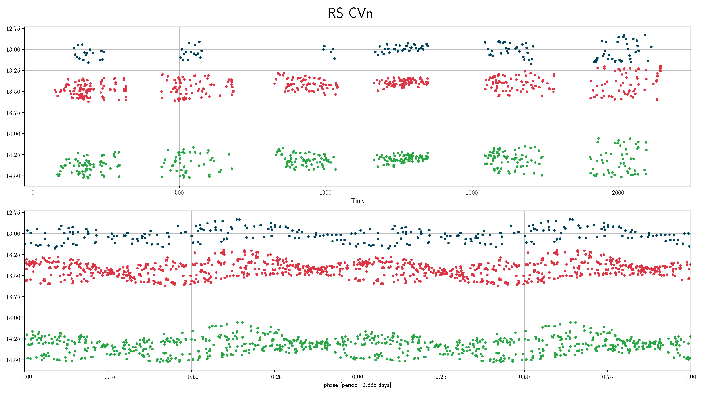
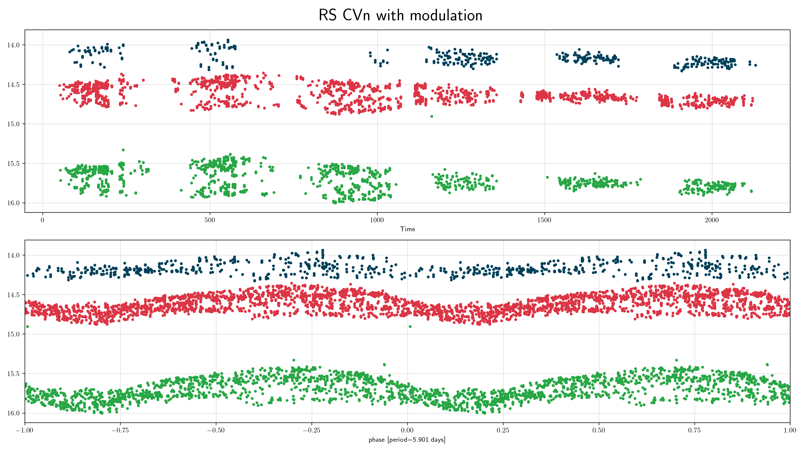
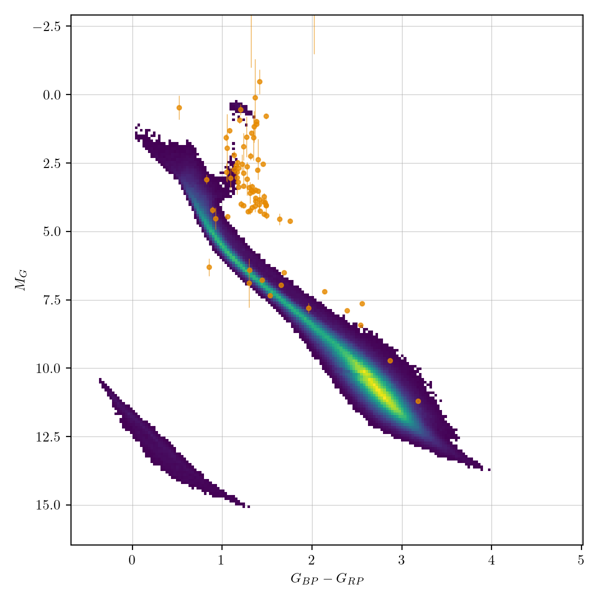
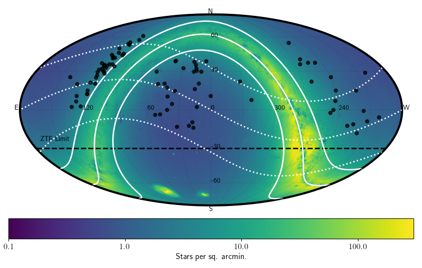

## RS CVn (rscvn)

### Classification and numbers
- Supertypes
  - variable
  - periodic
  - binary
- Occurrence rate: common, about 105 expected in ZTF data

### ZTF light curves

#### Description
RS Canum Venaticorum stars are binary systems in which one or both stars are
chromospherically active. The surface of the star (typically F or G main-sequence
or subgiant) is covered with groups of spots, which makes the surface brightness
inhomogeneous. These spots rotate with a period close to the orbital period.
However, the spot rotation period can differ slightly from the orbital period,
which causes the light curve shape to change over timescales of years. The
variability of the wave's amplitude is explained by the existence of a long-period
stellar activity cycle similar to the 11-year solar activity cycle, during which
the number and total area of spots on the star's surface vary. Small amplitude
flares, another signature of chromospheric activity, can also be observed in some
cases.

Other types of variable stars with chromospheric activity (which we do not
consider of the RS CVn type):
- white dwarf or hot subdwarf stars with a chromospherically active companion
- BY Dra variables (single rotating star, typically K or M type)
- UV Cet variables (flaring low mass main sequence stars)
- single solar-type stars with active chromospheres
- T Tau variables (young chromospherically active stars)
- W UMa binaries (overcontact binaries)
- FK Com stars (rapidly rotating single stars)
- single giants with active chromospheres

#### Light curve characteristics
- periodic variable
- period range: 0.5-50 days
- amplitude: 0.01 up to 0.6 mag
- light curve shape:
    - sinusoidal; or with two maxima and minima of different heights and depths
    - the shape can change over timescales of years (modulation)
    - they can show eclipses, but this is not required
    - can show stellar flares

#### Other characteristics and selection methods
- the chromospherically active star is a F or G main-sequence star
- often show Ca-II emission lines

### References and further reading:
- VSX: https://www.aavso.org/vsx/index.php?view=about.vartypes
- Sterken & Jasschek: Light curves of variable stars
