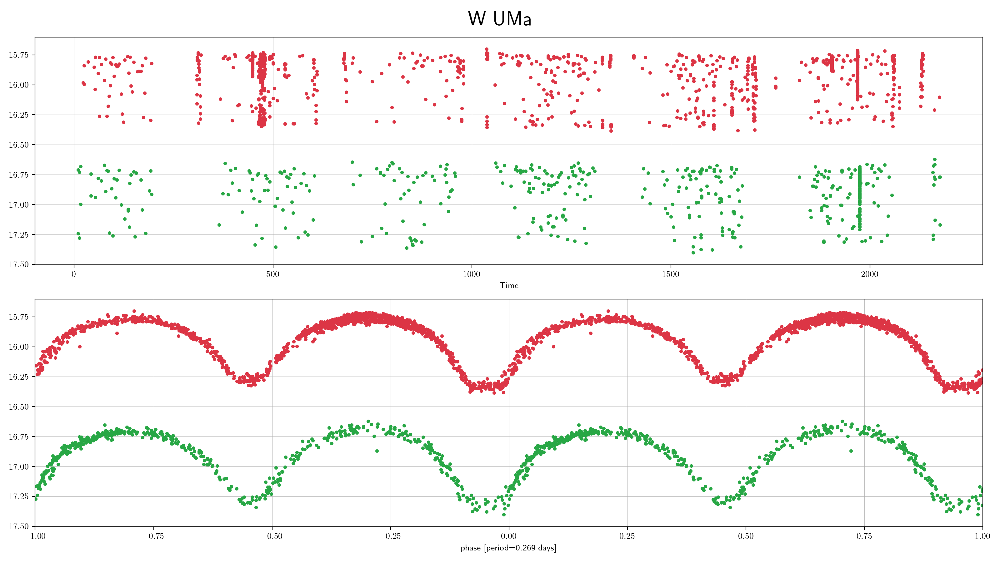
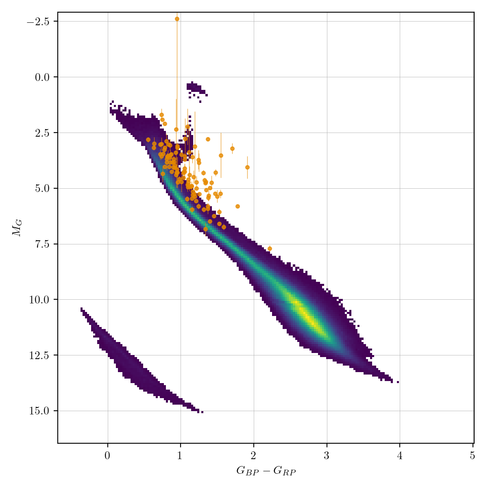
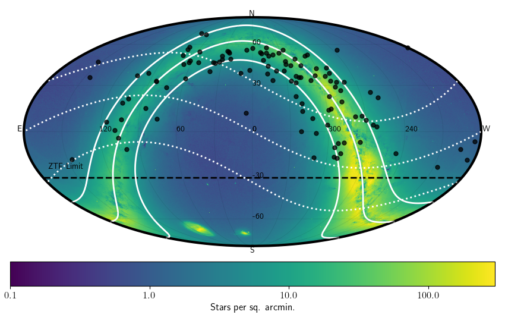

## W Uma (wuma)
W UMa stars are main-sequence overcontact binaries. In overcontact binaries both stars are too large for their Roche lobe share a common envelope and can exchange mass and energy. The mass-ratio of the system ranges from 1 to 10 in extreme cases. Components can have different raddii and surface brightness with temperatures ranging from 4000 to 9000K.

### Classification and numbers
- Supertypes
  - variable
  - periodic
  - binary
  - eclipsing
- Occurrence rate: very common, about 105 expected in ZTF data

### ZTF light curves

#### Description
Contact binary lightcurves show a distinctive shape that shows two eclipses which do smoothly transition over. Eclipses can have a flat bottom. The eclipse depth is often identical, but can be show slightly different depths. In rare cases there can be differences in the maxima of the lightcurves (e.g. due to starspots).

#### Light curve characteristics
- periodic variable
- period range: 0.22-0.8 days
- amplitude: up to 0.75 mag
- light curve shape: EW, two 'V'-shaped eclipses with smooth transitions
- eclipses often equal depth, within 0.1mag

#### Other characteristics and selection methods
- g-r = -0.1 -- 1.0. Short period systems are typically redder.
- absolute magnitudes are similar to main-sequence stars

### References and further reading:
- Sterken & Jasschek: Light curves of variable stars
- Marsh et al, MNRAS 465, 4678-4689, 2017
