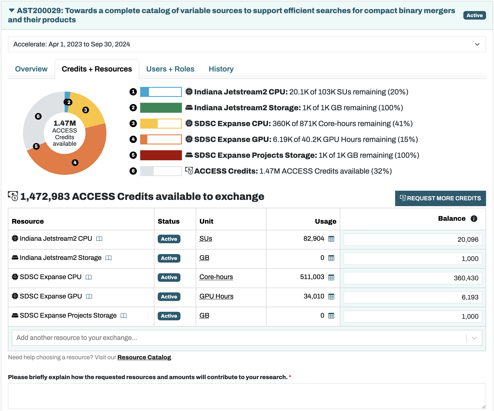

# ACCESS allocation management

This project (and others in the group) are supported in large part by computing resource allocations, e.g. from NSF ACCESS. When our group is granted ACCESS credits, we need to exchange them for the resources our group requires. This guide explains some details about that process.

## Viewing Resources

Users with the Allocation Manager role can view available allocations on the [ACCESS website](https://allocations.access-ci.org/). The different tabs show available resources, current users, and request history. The figure below shows the "Credits + Resouces" tab that is useful for viewing how much of each allocated resource remains.

## Making Requests

To request more resources, increase the associated "Balance" box on the right to the desired amount. Doing this will preview the exchange of credits for resources in the visualization of the balances. To submit the request, add a 1-2 sentence justification in the explanation box near the bottom of the page. This justification should mention what efforts the exchange will support and the basic reasons why the resources are being requested (at an approximate level). For example, the justification below accompanied a request for 5,000 Expanse GPUh:

*We will continue to perform GPU-accelerated time series feature generation on 20 more ZTF fields containing ~56 million light curves. At ~0.25s per lightcurve, and considering the added memory requirements of some fields leading to greater credit expenditure, we request an additional 5,000 Expanse GPUh.*

Note that it is always possible to turn unused resources back into the equivalent amount of credits. Use the [Exchange Calculator](https://allocations.access-ci.org/exchange_calculator) to calculate the exchange rates between credits and resources. From experience, ACCESS prefers not to allocate vast quantities of a single resource at once. Instead, more manageable requests should be made at regular intervals.

## Anticipating Trends

Clicking the chart buttons under the Usage column will show which users used how much of each resource. Over time, trends will tend to stabilize and make subsequent exchange requests more predictible. When managing the allocation, try to keep resources consistently available so projects do not get interrupted. If a resource is nearing exhaustion, Allocation Managers will receive an email from ACCESS with this information.

### Optimizing resource usage

If users seem to be using more resources than they need for their given project, reach out to ensure they are optimizing their slurm scripts. Many ACCESS resources have a basic unit that they consider to be 1 Service Unit (SU); for example, on SDSC Expanse 1 CPU SU = 1 core with 2GB of memory for one hour. Any additional memory used will scale up the CPU SU accounting charge by the ratio of the requested memory amount to 2 GB. 1 Expanse GPU SU is 1 GPU, <10CPUs, and <92G of memory. Additional GPUs/CPUs/memory beyond these levels will likewise scale up the GPU SUs charged to the group account.
